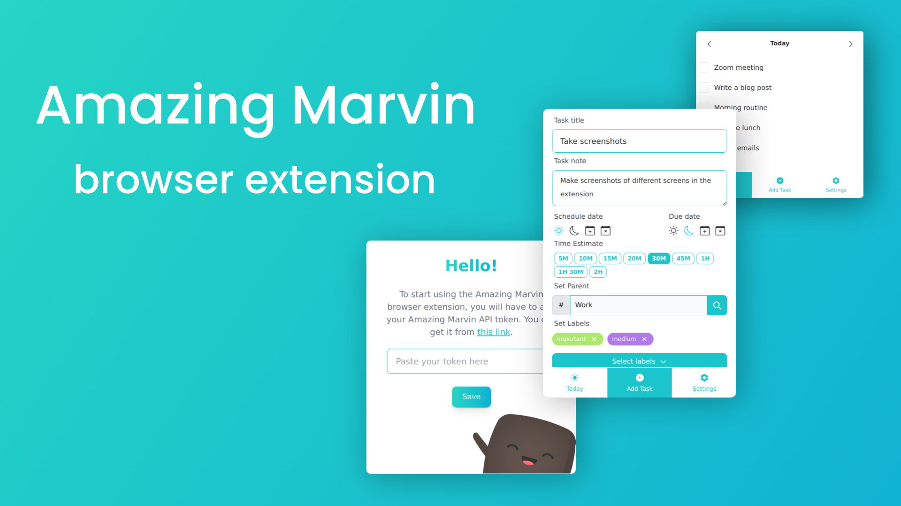
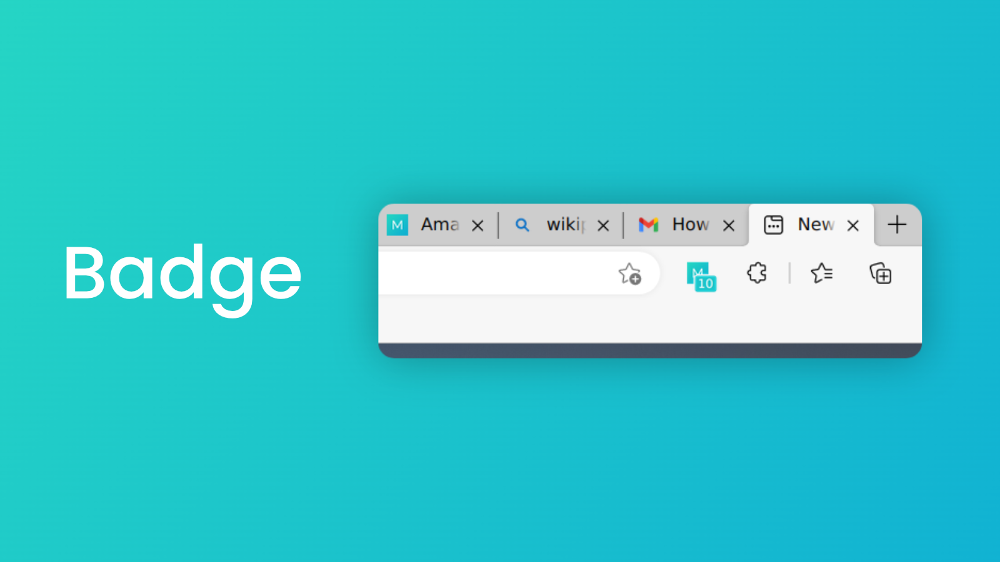
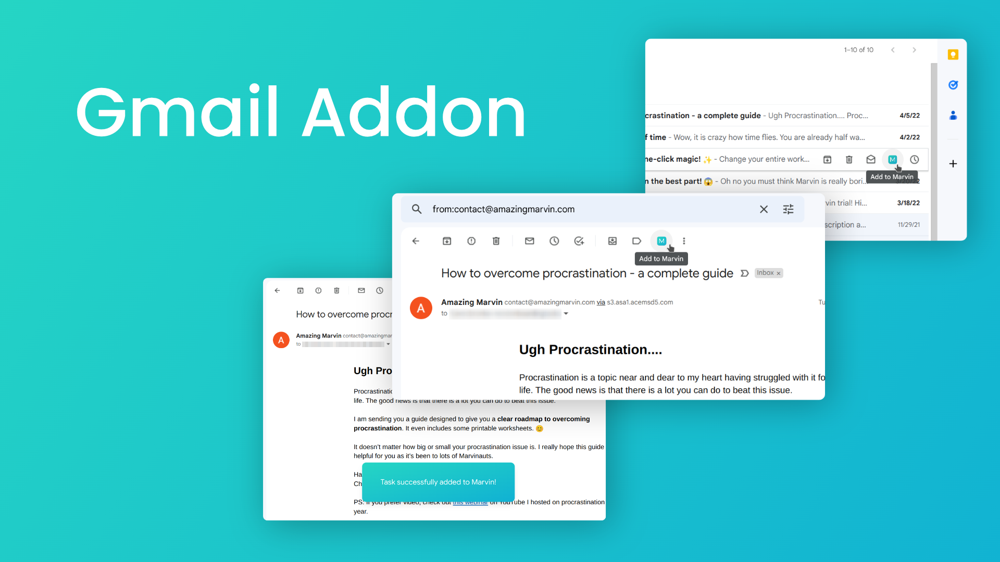
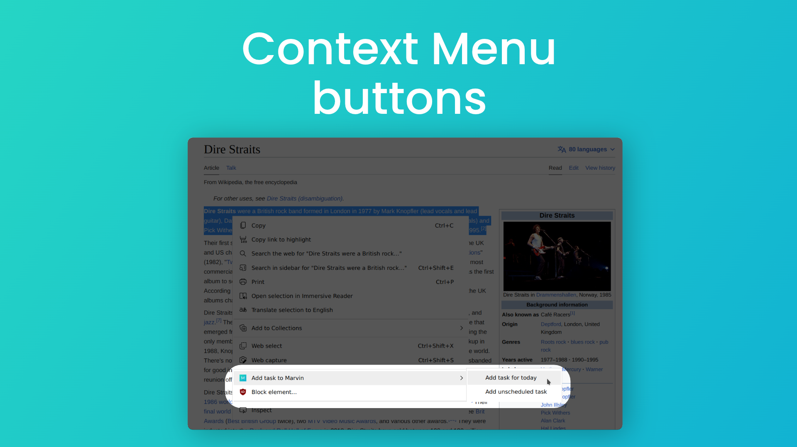
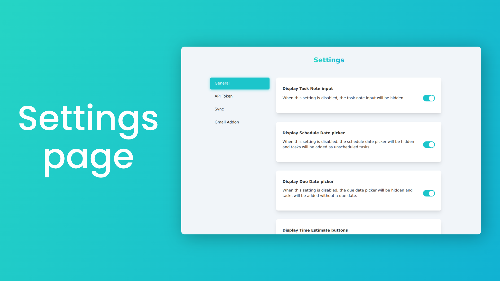

<h1 align="center" id="readme-top"> Amazing Marvin - Browser Extension </h1> <br>
<p align="center">
  <a href="https://amazingmarvin.com/">
    
  </a>
</p>

<p align="center">
  Browser Extension for Amazing Marvin app. Create new tasks and work on your daily task list.
</p>

<p>
Coming soon to Chrome Web Store and others!
</p>

<!-- TABLE OF CONTENTS -->
<details>
  <summary>Table of Contents</summary>
  <ol>
    <li><a href="#about-the-project">About The Project</a></li>
    <li><a href="#features">Features</a></li>
    <li><a href="#built-with">Built With</a></li>
    <li><a href="#installation">Installation</a></li>
  </ol>
</details>

## About The Project

<p align="center">
  <a href="https://amazingmarvin.com/">
    
  </a>
</p>

Amazing Marvin browser extension was built with the intention to help users quickly add tasks to their Marvin account
without having to open the app. Besides being able to add new tasks to Marvin, it also allows them to:

* See their daily list of tasks
* Add emails to Marvin
* Add snippets of selected text to Marvin in just two clicks

<p align="right">(<a href="#readme-top">back to top</a>)</p>

### Features

This section shows lists of features that are currently implemented in the extension.

* Badge with the number of tasks for today



* Gmail Addon - lets you add emails to Marvin, both from the list of emails and from the single email view. When the
  task is created, a message is displayed at the bottom to let users know that the task was created.



* Context menu buttons - Creates a new task in Marvin where:
    * The title is a hyperlink containing the page title and the URL of the page where the text was selected
    * The note is the selected text



* Extension also comes with a dedicated options page where users can configure the following:
    * Which buttons/inputs are visible in the Add Task view
    * Add/Change their API token
    * Force sync categories and labels
    * Where "Add to Marvin" button will be displayed in Gmail UI and whether the task will get scheduled for today



## Built With

Extension is built using:

* [React](https://react.dev) for the UI
* [TailwindCSS](https://tailwindcss.com/) and [DaisyUI](https://daisyui.com/) for styling
* [Parcel](https://parceljs.org/recipes/web-extension/) for bundling
* [React DayPicker](https://react-day-picker.js.org/) for the date picker
* [React Icons](https://react-icons.github.io/react-icons/) for icons

<p align="right">(<a href="#readme-top">back to top</a>)</p>

## Installation

### Building the extension

To start editing or using the exstension, you'll first need to clone the repo and install the dependencies. After that
you'll need to build it and then load it in your browser.

1. Clone the repo
   ```sh
   gh repo clone rijavecb/amazingmarvin-browserextension
   ```
2. Install NPM packages
   ```sh
   npm install
   ```
3. Run build script
   ```sh
    npm run build
    ```

### Loading the extension in your browser

To load the extension, go to the extensions page in your browser. For Chrome, you can go to `chrome://extensions/` and
for Edge, you can go to `edge://extensions/`. Once you're there, click on the "Load unpacked" button and select
the `dist` folder from the project.

<p align="right">(<a href="#readme-top">back to top</a>)</p>

<!-- ROADMAP -->

## Roadmap

- [ ] Save input data to local storage in case user closes the popup
- [ ] Optimize content script code
- [ ] Add support for Firefox
- [ ] Display currently tracked task in the popup

<p align="right">(<a href="#readme-top">back to top</a>)</p>
